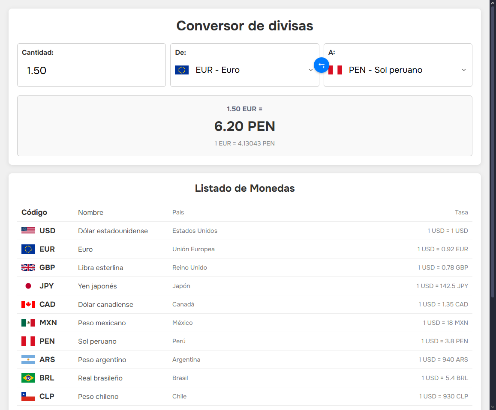

# 💱 Conversor de Divisas

Un conversor de divisas moderno e intuitivo desarrollado con HTML, CSS y JavaScript vanilla. Este es el **Proyecto #7** de mi serie de proyectos de desarrollo web.

## 📋 Descripción

Aplicación web que permite convertir entre diferentes divisas utilizando tasas de cambio predefinidas. Incluye una interfaz visual con banderas de países, botón de intercambio y una tabla completa de monedas disponibles con sus respectivas tasas de conversión.

## ✨ Características Implementadas

- **Conversión en tiempo real:** Cálculo automático al cambiar valores
- **17 divisas disponibles:** Incluye monedas principales y latinoamericanas
- **Interfaz visual:** Banderas de países para identificación rápida
- **Botón de intercambio:** Intercambia divisas de origen y destino
- **Tabla de divisas:** Lista completa con tasas de conversión
- **Validación de entrada:** Formateo automático de cantidades
- **Cálculos precisos:** Conversión a través de USD como base
- **Datos estructurados:** Información organizada en módulos ES6
- **Diseño responsivo:** Interfaz adaptable a diferentes dispositivos
- **Feedback visual:** Resultados claros con múltiples formatos

## 🛠️ Tecnologías Utilizadas

- **HTML5:** Estructura semántica moderna con:
  - Formularios accesibles con labels
  - Inputs numéricos con validación
  - Meta tags optimizados
  - Elementos semánticos (main, section)
- **CSS3:** Estilos avanzados con:
  - Flexbox para layouts responsivos
  - CSS Nesting moderno
  - Box-shadow para profundidad
  - Transitions suaves
  - Custom styling para selects
- **JavaScript ES6+:** Lógica avanzada con:
  - Módulos ES6 (import/export)
  - Event listeners múltiples
  - Manipulación del DOM
  - Cálculos matemáticos precisos
  - forEach para iteración
  - Template literals para HTML dinámico
- **Datos externos:** Archivo de divisas estructurado
- **Google Fonts:** Tipografía Onest (100-900 weights)
- **Flags API:** Banderas de países vía flagcdn.com

## 🎨 Diseño y Estilo

### Paleta de Colores

```css
/* Tema limpio y profesional */
--bg-primary: #f0f0f0; /* Fondo de página */
--bg-container: #ffffff; /* Fondo del contenedor */
--bg-result: #f9f9f9; /* Fondo del resultado */
--text-primary: #333333; /* Texto principal */
--text-secondary: #555555; /* Texto secundario */
--text-muted: #777777; /* Texto tenue */
--text-light: #888888; /* Texto claro */
--text-rate: #5c667b; /* Texto de tasas */
--accent: #007bff; /* Color de acento azul */
--accent-hover: #0056b3; /* Acento en hover */
--border: #cccccc; /* Bordes */
--border-light: #eeeeee; /* Bordes claros */
```

### Efectos Especiales

- **Box-shadow elevado** en contenedores principales
- **Botón circular** de intercambio con posición absoluta
- **Transiciones suaves** en hover (0.3s ease)
- **Banderas integradas** en selects con flexbox
- **Tabla alternada** con bordes sutiles

## 💰 Divisas Soportadas

### Monedas Principales

| Código  | Moneda               | País           | Tasa (USD) |
| ------- | -------------------- | -------------- | ---------- |
| **USD** | Dólar estadounidense | Estados Unidos | 1.0        |
| **EUR** | Euro                 | Unión Europea  | 0.92       |
| **GBP** | Libra esterlina      | Reino Unido    | 0.78       |
| **JPY** | Yen japonés          | Japón          | 142.5      |
| **CAD** | Dólar canadiense     | Canadá         | 1.35       |

### Monedas Latinoamericanas

| Código  | Moneda          | País      | Tasa (USD) |
| ------- | --------------- | --------- | ---------- |
| **MXN** | Peso mexicano   | México    | 18.0       |
| **PEN** | Sol peruano     | Perú      | 3.8        |
| **ARS** | Peso argentino  | Argentina | 940.0      |
| **BRL** | Real brasileño  | Brasil    | 5.4        |
| **CLP** | Peso chileno    | Chile     | 930.0      |
| **COP** | Peso colombiano | Colombia  | 3900.0     |
| **UYU** | Peso uruguayo   | Uruguay   | 42.0       |

_Y más divisas disponibles en la aplicación..._

## 📂 Estructura del Proyecto

```
07-currency-converter/
├── index.html              # Página principal
├── styles.css              # Estilos CSS
├── script.js               # Lógica JavaScript
├── data/                   # Datos de divisas
│   └── currencies.js       # Información de monedas
├── screenshots/            # Capturas de pantalla
│   └── app-view.png        # Vista de la aplicación
└── README.md              # Documentación
```

## 🚀 Instalación y Uso

### Clonar el repositorio

```bash
git clone https://github.com/Zero-Fhx/07-currency-converter.git
cd 07-currency-converter
```

### Ejecutar el proyecto

1. **Método simple:** Abre `index.html` directamente en tu navegador
2. **Con Live Server (recomendado):**
   - Instala Live Server en VS Code
   - Click derecho en `index.html` → "Open with Live Server"
3. **Servidor local:**

   ```bash
   # Con Python 3
   python -m http.server 8000

   # Con Node.js (http-server)
   npx http-server
   ```

## ✅ Requisitos Cumplidos

Este proyecto incluye todas las características esenciales de un conversor de divisas:

- [x] Conversión entre múltiples divisas
- [x] Interfaz intuitiva y fácil de usar
- [x] Cálculos precisos en tiempo real
- [x] Datos estructurados de monedas
- [x] Validación de entrada de usuario
- [x] Interfaz visual atractiva
- [x] Información completa de divisas
- [x] Funcionalidad de intercambio rápido

## 🌐 Demo en Vivo

🔗 **[Ver Demo](https://zero-fhx.github.io/07-currency-converter/)** (GitHub Pages)

## 📸 Captura de Pantalla



## 🔧 Características Técnicas Destacadas

### Estructura de Datos de Divisas

```javascript
const currencies = {
  USD: {
    country: "Estados Unidos",
    currencyName: "Dólar estadounidense",
    symbol: "$",
    rate: 1.0,
    flag: "https://flagcdn.com/us.svg",
  },
  EUR: {
    country: "Unión Europea",
    currencyName: "Euro",
    symbol: "€",
    rate: 0.92,
    flag: "https://flagcdn.com/eu.svg",
  },
  // ... más divisas
};
```

### Algoritmo de Conversión

```javascript
function convert() {
  let amountValue = parseFloat(amount.value);
  if (isNaN(amountValue)) amountValue = 0;

  const fromRate = currencies[fromCurrency.value].rate;
  const toRate = currencies[toCurrency.value].rate;

  // Conversión a través de USD como base
  const convertedAmount = (amountValue / fromRate) * toRate;

  result.innerHTML = `
    <p id="conversion-amount">${amountValue.toFixed(2)} ${
    fromCurrency.value
  } =</p>
    <p id="conversion-result">${convertedAmount.toFixed(2)} ${
    toCurrency.value
  }</p>
    <p id="conversion-rate">1 ${fromCurrency.value} = ${(
    toRate / fromRate
  ).toFixed(5)} ${toCurrency.value}</p>
  `;
}
```

### Función de Intercambio

```javascript
swapButton.addEventListener("click", () => {
  const temp = fromCurrency.value;
  fromCurrency.value = toCurrency.value;
  toCurrency.value = temp;
  updateFlags(fromCurrency);
  updateFlags(toCurrency);
  convert();
});
```

### Actualización Dinámica de Banderas

```javascript
function updateFlags(select) {
  const flagImg =
    select.id === "from-currency"
      ? document.getElementById("from-flag")
      : document.getElementById("to-flag");

  if (currencies[select.value]) {
    flagImg.src = currencies[select.value].flag;
    flagImg.style.display = "inline";
  } else {
    flagImg.style.display = "none";
  }
}
```

### Poblado Dinámico de Selects

```javascript
function populateCurrencySelects() {
  for (const select of selects) {
    for (const currencyCode in currencies) {
      const option = document.createElement("option");
      option.value = currencyCode;
      option.textContent = `${currencyCode} - ${currencies[currencyCode].currencyName}`;
      select.appendChild(option);
    }
  }
}
```

### Validación de Entrada Numérica

```javascript
amount.addEventListener("blur", (e) => {
  let val = parseFloat(e.target.value);
  e.target.value = isNaN(val) ? "0.00" : val.toFixed(2);
});
```

## 💱 Funcionalidades del Conversor

### Conversión en Tiempo Real

- **Input automático:** Conversión al escribir en el campo cantidad
- **Cambio de divisa:** Recálculo automático al cambiar selects
- **Formateo numérico:** Dos decimales para precisión

### Información Completa

- **Tasa exacta:** Muestra la conversión 1:1 entre divisas
- **Resultado formateado:** Cantidad convertida con decimales
- **Contexto visual:** Banderas para identificación rápida

### Tabla de Divisas

- **17 monedas:** Principales y latinoamericanas
- **Información completa:** Código, nombre, país y tasa
- **Referencia USD:** Todas las tasas basadas en dólar

## 🔮 Futuras Mejoras

- [ ] **API de tasas reales** (ExchangeRate-API, Fixer.io)
- [ ] **Actualización automática** de tasas cada hora
- [ ] **Historial de conversiones** con localStorage
- [ ] **Gráficos de tendencias** de tasas de cambio
- [ ] **Modo offline** con última actualización
- [ ] **Más divisas** (criptomonedas, metales preciosos)
- [ ] **Calculadora de comisiones** bancarias
- [ ] **Alertas de tasas** favorables
- [ ] **Export/Import** de configuraciones
- [ ] **Tema oscuro** opcional

## 📝 Lecciones Aprendidas

### Módulos ES6

- **Import/Export** para organización de código
- **Separación de datos** en archivos independientes
- **Encapsulación** de información estructurada

### Manipulación del DOM

- **Creación dinámica** de elementos HTML
- **Event delegation** eficiente
- **Template literals** para HTML complejo
- **Actualización selectiva** de elementos

### Cálculos Financieros

- **Conversión indirecta** a través de moneda base
- **Precisión decimal** con toFixed()
- **Validación numérica** robusta
- **Formateo de resultados** consistente

### UX/UI Design

- **Feedback inmediato** en todas las acciones
- **Interfaz intuitiva** con elementos visuales
- **Accesibilidad** con labels y estructura semántica
- **Progressive enhancement** sin dependencias externas

### Organización de Datos

- **Estructura JSON** para información compleja
- **APIs externas** para recursos (banderas)
- **Normalización** de datos de entrada
- **Escalabilidad** para agregar más divisas

## 🤝 Contribuciones

Este es un proyecto personal de aprendizaje, pero si encuentras mejoras o tienes sugerencias:

1. Fork el repositorio
2. Crea una rama para tu feature (`git checkout -b feature/mejora`)
3. Commit tus cambios (`git commit -m 'Añadir mejora'`)
4. Push a la rama (`git push origin feature/mejora`)
5. Abre un Pull Request

## 👨‍💻 Autor

**Erick Obed Flores Ricra**

- 🐙 GitHub: [@Zero-Fhx](https://github.com/Zero-Fhx)
- 💼 LinkedIn: [Erick Obed Flores Ricra](https://www.linkedin.com/in/erick-obed-flores-ricra-14a121280)
- 📧 Email: erickflores170404@gmail.com

---

**🤖 Desarrollo Asistido por IA:** Este proyecto fue desarrollado con la asistencia de inteligencia artificial para la búsqueda de información, resolución de problemas técnicos, optimización de código, consulta de conceptos desconocidos y creación de esta documentación.
